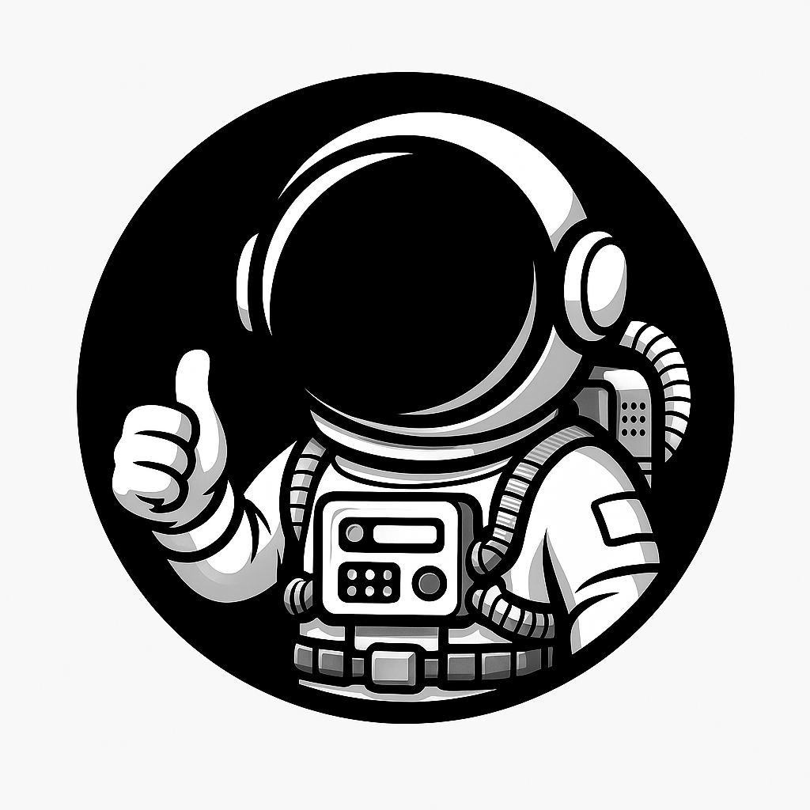

# Greysun-Greyband-Portfolio
Product, UX, and marketing work for GreyBand, a wearable breathalyzer and companion app by GreySun Technologies. Includes UI design and web content created in collaboration with the founding team.

# GreyBand App & Marketing UI – Design Portfolio

This repository showcases selected UI/UX work I contributed to for **GreyBand**, a wearable alcohol-tracking device and companion mobile app developed by GreySun Technologies. My work focused on creating Figma UI layouts for both the mobile experience and the marketing / crowdfunding pages.

---

## Project Overview
GreyBand is a wearable breathalyzer that connects to a mobile app to help users track alcohol intake and receive safety-focused feedback. I contributed to the **UI design**, **layout**, and **visual presentation** for key app flows as well as sections of the product’s public-facing launch pages.

This repo contains **external links** to the Figma design file and Indiegogo page where the live layouts can be viewed.

---

## My Contributions
### **Figma UI / UX Work**
- Created and refined high-fidelity UI screens in Figma  
- Designed layout structures for:
  - Home dashboard  
  - BAC readings and history  
  - User profiles and onboarding  
  - Morning report + symptom survey flows  
  - Calendar / scheduling views  
  - Monthly insights and analytics  
- Contributed to iconography, spacing, hierarchy, color usage, and screen structure

### **Web / Campaign Design**
- Assisted in structuring and formatting sections of the GreyBand Indiegogo launch page  
- Organized feature explanations, visuals, and text hierarchy  
- Helped translate Figma layouts into the final webpage experience  

---

### **Character & Motion Design – Astro Mascot**
- Designed **Astro**, GreyBand’s animated mascot, as a friendly guide throughout the mobile app  
- Created hand-drawn character concepts in **Adobe Illustrator**  
- Developed expressive poses and UI-friendly silhouettes  
- Animated the character in **Adobe After Effects** for onboarding tutorials, user feedback moments, and celebratory micro-interactions  
- Integrated Astro into multiple app flows, reinforcing tone, clarity, and user engagement  

---

## External Links
**Figma UI (GreyBand 2.0):**  
[https://www.figma.com/design/dry1EMPA4qj2Bb7qpLV7rB/Greyband-2.0-UI](https://www.figma.com/design/dry1EMPA4qj2Bb7qpLV7rB/Greyband-2.0-UI)

**Indiegogo Campaign Page:**  
[https://www.indiegogo.com/en/projects/greysuntechnologies/greyband-wearable-breathalyzer](https://www.indiegogo.com/en/projects/greysuntechnologies/greyband-wearable-breathalyzer)

---

## Tools Used
- **Figma** (primary UI design + prototyping)
- Squarespace / Indiegogo editors (layout implementation)
- Adobe Creative Suite (supporting visual assets)
